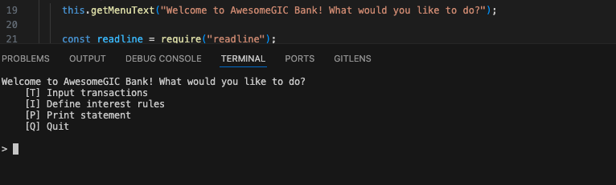
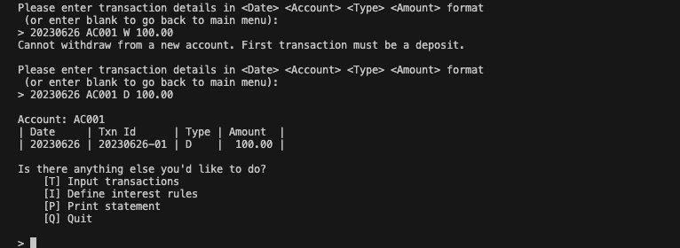
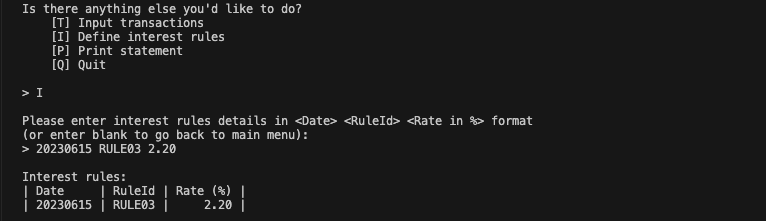
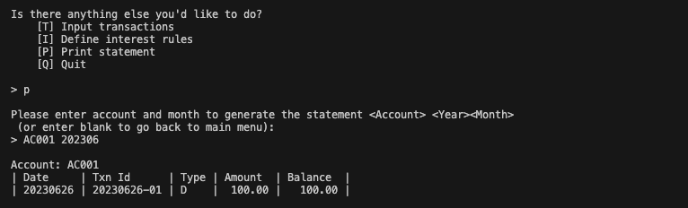
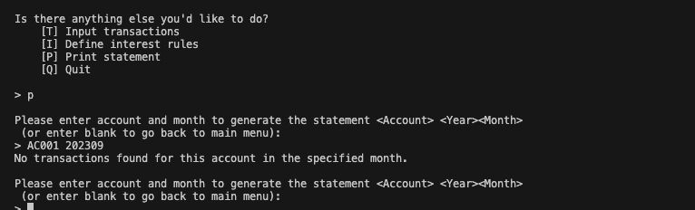

## Run 
### install node js in your system
### Open the termainal and run :  clear && node bank-Js.js

## Outputs

### Add Transaction Deposit/Withdrawal

### Interest Rules

### Payment Statement

